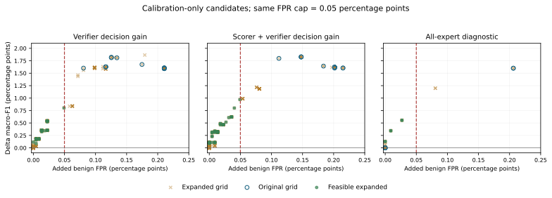

# 0909 — 고정 global 위의 scorer/verifier 교정 실험

EXP38 cache 생성과 EXP39 6조건 평가가 **정상 완료**됐다. 원본 test 4,023,114행에서 최종 정책은 모두 global 유지로 선택되어 추가 F1 개선은 0이다. 다만 **결정 손익 목표는 calibration에서 실제 교정을 만들었고, 기존 임계값 격자가 유효한 높은 점수 영역을 충분히 탐색하지 않은 문제**를 확인했다. 아래는 구현 변경, 원래 완료 결과, 사후 calibration 진단을 구분한 기록이다.

## 1. 모델 처리 순서별 현재·변경·근거

| 단계 | 현재(EXP31) | 변경(EXP38·39) | 근거·이번 실험에서 확인할 점 |
|---|---|---|---|
| ① Context 내 세부 패턴 | Class/scenario 피복 보완을 수행했지만 내부 feature mode까지 최소 지원을 보장하지 않음. | **이번에는 행을 바꾸지 않음.** C0·anchor·expert block의 class×scenario 포함 수를 저장. Mode별 지원·고유 벡터 피복 개선은 다음 실험. | 먼저 동일 context에서 라우팅 효과를 분리. 모든 세부 클래스가 부족하다고 단정하지 않음. |
| ② Global 기준선 | C0 추첨·TabPFN config 변동이 개입층 비교에 섞일 수 있음. | **C0 행 ID·seed 42·n_estimators=4를 고정**해 한 번 복원하고 모든 조건이 동일 예측 cache를 사용. | 저장된 fitted 모델이 없으므로 재복원 오차를 별도 기록. 원본 global과 새 기준선의 차이를 라우팅 효과로 세지 않음. |
| ③ Residual → expert context | Shared anchor + residual block으로 취약 구간 전문화. | **기존 bank 3개를 고정.** 다음 구성 변경은 `anchor + residual 취약 구간의 support + 혼동 contrast`이며, tail·중간·큰 클래스 모두 대상. | Global residual은 취약 구간과 지원 사례를 고르는 핵심 정보로 유지. 이번에는 context 구성을 동시에 바꾸지 않아 scorer/verifier와 원인을 분리. |
| ④ Scorer 학습 정답 | 임시 OOF verifier의 수락 b를 NLL gain에 곱해 scorer sign 정답을 만듦. 거절한 후보는 negative로 학습. | `decision_both_raw`는 **b를 곱하지 않고** 모든 route pair의 `expert_correct − global_correct`를 직접 학습. 기존 의존성을 유지한 control을 함께 둠. | Verifier의 놓침이 scorer의 정답으로 전달되는 경로를 분리. 모든 expert 실행은 원래도 수행하던 오프라인 학습 절차. |
| ⑤ Scorer → expert 호출 | 호출 전 feature로 expert별 점수를 예측하고 top-1을 선택. | 이 추론 순서를 유지하고 **예상 결정 이득**을 학습. 진단용 `dense_decision_raw`만 scorer를 우회하고 전체 expert 출력을 관측. | 예상 점수 계산은 expert 호출과 다름. Dense 진단은 post 정보가 충분할 때의 교정력을 확인하는 비교이며 최종 sparse 모델과 구분. |
| ⑥ Verifier 입력 | p0·pk·차이·불확실성·거리·descriptor, z/raw 입력 없음. | `post_z`는 **z만 추가**, `post_raw`는 **raw46만 추가**. 같은 fitted legacy scorer와 NLL 목표 사용. | 입력 정보 보강만의 효과를 비교. 두 보강을 동시에 적용하지 않음. |
| ⑦ Verifier 학습 목표 | Normalized NLL gain의 0.25 분위수 예측. | `decision_post_raw`는 raw 입력을 유지하고 **결정 손익의 평균 회귀**로 변경. Route의 클래스별 균형 sample weight 적용. | Expert만 정답 +1, global만 정답 −1, 나머지 0. 중간 클래스 교정도 보상. 목표와 회귀 방식이 함께 바뀌는 하나의 구성 변경으로 기록. |
| ⑧ Calibration → 최종 교정 | NLL 순이득 최대화, 기존 오경보·harmful fraction·호출량 제약. | 모든 조건에 **Δmacro-F1 최대화**, tail 평균 ΔF1≥0, brute_force/ddos/dos 각각 ΔF1≥0, benign ΔFPR≤0.0005, 결정 손익 표본≥30 적용. | 학습 손익은 F1과 다르므로 최종 예측의 F1을 직접 계산. 과거 train prior로 confusion matrix를 표준화. 이 공통 평가 변경과 각 arm의 모델 변경을 구분. |
| ⑨ 확인 구간·비용 | 기존 calibration을 이용한 임계값 선택. | Route와 겹치는 hash 제외 후 class×scenario 안에서 앞 70% 선택 / 뒤 30% 확인. 확인 구간의 선택 구간 중복 hash도 제외. 호출 상한은 1.0, harmful fraction은 진단 지표로 전환. | 표본 비중 차이와 시간 전이를 구분. 이번 우선 목표는 교정 성능이며 비용만 줄어든 결과를 개선으로 세지 않음. 전역 달력 절단이 아닌 scenario 내부 시간 분할. |

학습 목표 `Δk = 1[expert 정답] − 1[global 정답]`. 학습은 모든 pair의 관측 결과를 이용한 지도학습이다. 실제 추론은 **global → scorer의 예상 점수 → 선택 expert만 실행 → verifier 채택/거절** 순서를 유지한다.

## 2. 고정한 조건과 비교군

| 항목 | 실행값 |
|---|---|
| 기준 run | `20260904_010654_nfv3_cic2018_exp31_c0alloc` |
| 새 run | `20260909_160742_1059961_nfv3_cic2018_exp39_decision_routing` |
| C0 / anchor / expert block | 100,000 / 12,761 / 15,861·186,000·290행 |
| 모델 설정 | TabPFN-3, seed 42, n_estimators=4, 고정된 3개 expert |
| Global 재복원 | 원본 macro 0.762302 → 재복원 0.762086; 예측 라벨 2,447행 차이. 모든 새 조건은 재복원 결과를 공동 사용 |
| Route / calibration 선택 / 확인 / test | 391,486 / 81,472 / 33,213 / 4,023,114행 |
| Calibration 선택의 benign / web | 22,325 / 100행; 확인 구간 9,353 / 41행 |
| 공통 XGBoost 학습기 예산 | 300 trees, depth 6, learning rate 0.05, CPU 16 threads |
| 결정 모델 가중 | Route 클래스별 `N / (C × N_c)` sample weight |
| 실행 시간 | Cache 32.38분 + EXP39 98.5초. Cache 조회 시간을 실제 sparse PFN 추론 지연으로 해석하지 않음 |
| 평가 범위 | 단일 seed, 기존에 반복 사용한 development holdout. 새로운 untouched test 검증이 아님 |

| 비교군 | Scorer | Verifier 입력·목표 | 변경 비교 |
|---|---|---|---|
| legacy | OOF b×NLL sign | 기존 입력 / NLL 분위수 | 공통 프로토콜 대조 |
| post_z | 같은 legacy scorer | 기존+z / NLL 분위수 | legacy 대비 입력만 |
| post_raw | 같은 legacy scorer | 기존+raw46 / NLL 분위수 | legacy 대비 입력만 |
| decision_post_raw | 같은 legacy scorer | 기존+raw46 / 결정 손익 평균 | post_raw 대비 verifier 목표·회귀 방식 |
| decision_both_raw | 결정 손익 평균 | 같은 decision verifier | decision_post_raw 대비 scorer 감독 신호 |
| dense_decision_raw | 우회·전체 expert 관측 | 같은 decision verifier | 사후 정보에 기반한 진단 |

`legacy`도 새 calibration 절차와 공통 학습기 설정을 쓰므로 EXP31 원본의 정확한 재실행은 아니다. 모든 조건의 학습·임계값을 결정한 뒤 test 정답으로 평가했다. 원본 실험 스크립트와 결과는 수정하지 않았다.

## 3. 완료된 full-test 결과

| 방법 | Macro-F1 | Tail F1 | Benign FPR | 교정 / 훼손 행 | 해석 |
|---|---:|---:|---:|---:|---|
| global | 0.762086 | 0.548877 | 0.1523% | 0 / 0 | 기준선 |
| legacy | 0.762086 | 0.548877 | 0.1523% | 0 / 0 | global 유지 |
| post_z | 0.762086 | 0.548877 | 0.1523% | 0 / 0 | global 유지 |
| post_raw | 0.762086 | 0.548877 | 0.1523% | 0 / 0 | global 유지 |
| decision_post_raw | 0.762086 | 0.548877 | 0.1523% | 0 / 0 | global 유지 |
| decision_both_raw | 0.762086 | 0.548877 | 0.1523% | 0 / 0 | global 유지 |
| dense_decision_raw | 0.762086 | 0.548877 | 0.1523% | 0 / 0 | global 유지 |
| correctness_oracle | 0.849159 | 0.748924 | 0.0693% | 30,663 / 0 | 정답을 사용하는 진단 |
| expert1_always | 0.631228 | 0.362831 | 53.4832% | 27,673 / 1,869,000 | 단일 expert 전체 적용 |
| expert2_always | 0.694409 | 0.409213 | 0.1343% | 2,951 / 35,400 | 단일 expert 전체 적용 |
| expert3_always | 0.651426 | 0.367657 | 38.5245% | 24,524 / 1,344,307 | 단일 expert 전체 적용 |

6조건의 선택 임계값은 모두 `global_fallback`이다. 따라서 채택·라벨 변경·교정·훼손 모두 0이며, 이를 라우팅 성능 개선 또는 비용 절감 성공으로 세지 않는다. Correctness oracle은 global 오답을 맞힐 수 있는 expert가 있으면 정답을 선택하는 진단이며 실제 달성 보장이 아니다.

| 클래스 | Test 표본 수 | Global F1 = 6조건 F1 | Correctness oracle F1 | Oracle 교정 가능 행 |
|---|---:|---:|---:|---:|
| benign | 3,502,926 | 0.994950 | 0.999301 | 2,907 |
| bot | 41,542 | 0.998421 | 0.998529 | 5 |
| brute_force | 115,040 | 0.915874 | 0.915874 | 0 |
| ddos | 264,872 | 0.995782 | 0.999994 | 2,214 |
| dos | 60,594 | 0.781366 | 0.782174 | 64 |
| infiltration | 37,631 | 0.400205 | 0.970450 | 25,423 |
| web_attacks | 509 | 0.248007 | 0.277793 | 50 |

현재 bank의 oracle 교정 30,663행 중 infiltration이 25,423행이다. Brute force는 **교정 가능한 expert 출력이 0행**이고 dos도 64행이다. 이 두 클래스는 라우팅만 바꾸어 해결할 수 있는 폭이 작으므로, 다음 context 실험에서 해당 residual 취약 구간의 support·contrast를 보강해야 한다. Oracle 격차 전체를 학습 가능한 라우팅 이득으로 간주하지 않는다.

## 4. 왜 최종 개입이 0이 됐는가

다음 수치는 **calibration 선택 구간에서 기존 격자의 최고 macro 후보**이며 채택된 정책이나 test 개선 수치가 아니다. ΔF1은 과거 train prior로 표준화한 confusion matrix에서 계산했다. 교정/훼손은 원래 calibration 표본의 행 수다.

| 조건 | 양의 macro 후보 / 전체 | 최고 Δmacro | 해당 Δtail | 해당 Δbenign FPR | 교정 / 훼손 | 선택되지 않은 이유 |
|---|---:|---:|---:|---:|---:|---|
| legacy | 0 / 52 | +0.000000 | +0.000000 | +0.0000%p | 0 / 0 | 교정 표본 부족·일부 tail 하락 |
| post_z | 0 / 52 | +0.000000 | +0.000000 | +0.0000%p | 0 / 0 | 교정 표본 부족·일부 tail 하락 |
| post_raw | 0 / 52 | +0.000000 | +0.000000 | +0.0000%p | 0 / 0 | 교정 표본 부족(라벨 변경 0) |
| decision_post_raw | 50 / 65 | +0.018208 | +0.042495 | +0.1254%p | 764 / 28 | benign FPR 상한 초과 |
| decision_both_raw | 65 / 65 | +0.018270 | +0.042661 | +0.1478%p | 780 / 33 | benign FPR 상한 초과 |
| dense_decision_raw | 4 / 18 | +0.016003 | +0.037473 | +0.2060%p | 764 / 46 | benign FPR·일부 중간 클래스 제약 또는 표본 부족 |

입력에 raw만 추가한 NLL 목표는 최고 후보에서도 라벨 교정이 0이다. 같은 raw 입력에서 **결정 손익 목표**로 바꾸면 infiltration 교정 764행과 benign 훼손 28행이 나타난다. Scorer까지 바꾸면 교정 780행(infiltration 779·dos 1)과 benign 훼손 33행이다. 이것은 calibration에서 목표 변경의 효과이며, 최종 test 향상으로 주장할 수 없다.

선택 구간의 benign은 22,325행이다. ΔFPR≤0.0005를 지키려면 기존 오경보 교정을 차감한 신규 오경보가 약 11행 이하여야 한다. 28·33행을 함께 채택하는 기존 후보들은 이 상한을 넘는다.

## 5. 사후 진단: 임계값 격자에서 빠진 구간

기존 격자는 전체 행 점수의 99% 분위수까지만 생성했다. `decision_both_raw`의 post 임계값 최댓값은 **0.611627**이지만, 라벨이 바뀌는 후보의 post 점수 95% 분위수는 **0.910811**이다. Pre 점수 역시 변경 후보 상위 구간이 충분히 포함되지 않았다. 후보가 적은 교정 문제에서 전체 행의 분위수만 사용하면 필요한 세밀한 선택 범위가 빠질 수 있다.

**완료된 모델·cache와 calibration 선택 구간만 사용**해 라벨 변경 후보 점수의 분위수를 추가했다. Benign·tail·중간 클래스·최소 교정 표본 제약은 그대로 유지했다. 확인 구간과 test에는 새 후보를 적용하지 않았고, 원래 EXP39의 결과를 덮어쓰지 않았다.

| 조건 | 추가 격자의 pre / post 후보 | Calibration Δmacro | Calibration Δtail | Calibration Δbenign FPR | 교정 / 훼손 |
|---|---:|---:|---:|---:|---:|
| decision_post_raw | 0.968356 / 0.870510 | +0.008035 | +0.018750 | +0.0493%p | 310 / 11 |
| decision_both_raw | 0.926194 / 0.611627 | +0.009718 | +0.022659 | +0.0493%p | 376 / 11 |
| dense_decision_raw | -inf / 0.929575 | +0.005550 | +0.012926 | +0.0269%p | 215 / 6 |

이 결과는 **제약을 완화하지 않고도 탐색 격자를 수정할 근거**다. 새 모델의 검증된 성능으로 보고하지 않는다. 특히 11행 후보는 상한 근처이므로 다음 독립 확인 구간에서 안정성을 확인해야 한다.



그림은 calibration의 낮은 오경보 증가 영역(0–0.25%p)을 표시한다. 원래 격자와 사후 보완 격자를 구분하며, 모두 test 수치가 아니다.

## 6. 다음 변경 — 결과에서 직접 이어지는 수정

| 부분 | 현재 | 다음 변경 | 근거·검증 |
|---|---|---|---|
| 임계값 격자 | 전체 행 분위수로 높은 교정 점수 구간 누락 | 라벨 변경 후보의 점수 분위수·경계값을 추가하고 같은 위험 상한 유지 | Calibration에서 유효 후보 확인. 별도 frozen 후속 실험으로 선택한 뒤 확인 구간에 적용; 기존 test 결과와 구분 |
| Scorer/verifier | 결정 손익이 교정 후보를 만들지만 benign 훼손 동반 | 먼저 격자 수정만 비교; 이후 남는 혼동 구간에 대해 helpful/harmful 분리 추정·대조 evidence 보강 | 목표·입력·context를 다시 한꺼번에 바꾸지 않음 |
| 중간 클래스 expert context | Brute oracle 교정 0, dos 64행 | 모든 클래스의 residual 취약 구간에서 지원 사례와 혼동 negative를 구성 | 해당 클래스에 교정 가능한 expert 출력이 늘어나는지 같은 예산에서 먼저 확인 |
| Context 피복 | 기존 행 고정 및 class×scenario 수만 감사 | 관측 가능한 mode별 지원·고유 벡터 수를 점검한 뒤 부족한 구간 보강 | 세부 클래스 결손이 이미 입증된 것으로 쓰지 않음; 같은 크기·비중·config 대조 |

## 7. 문헌·코드·재현 기록

| 항목 | 반영 |
|---|---|
| 원본 문헌조사 | [tabpfn_papers_survey.xlsx](../../docs/tabpfn_papers_survey.xlsx): HINT(9/7), LoGIC(9/5), Xiaomi-TabLDM(v1 9/3·v2 9/4) 추가. 총 102편, Ch.2 38편 |
| 설계 근거 | [상세 조사](../../docs/research/20260909/research_and_model_proposal.md), [학습·추론·지표 설명](../../docs/research/20260909/mechanism_clarifications.md) |
| 구현 | [EXP38](../../tabpfn/scripts/nfv3_v3_exp38_frozen_cache.py), [EXP39](../../tabpfn/scripts/nfv3_v3_exp39_decision_routing.py) |
| 완료 결과 | [summary.csv](../../tabpfn/results/20260909_160742_1059961_nfv3_cic2018_exp39_decision_routing/summary.csv), [클래스별 결과](../../tabpfn/results/20260909_160742_1059961_nfv3_cic2018_exp39_decision_routing/per_class_metrics.csv), [선택 임계값](../../tabpfn/results/20260909_160742_1059961_nfv3_cic2018_exp39_decision_routing/selected_thresholds.json) |
| 사후 진단 | [진단 코드](../../scripts/exp39_calibration_audit.py), [calibration 격자 감사](../../docs/research/20260909/exp39_completed_audit/calibration_grid_audit.csv) |
| 검증 | [테스트 6개 통과](../../tabpfn/tests/test_exp39_decision_routing.py): 손익 라벨, weighted F1, benign·중간 클래스 제약, 시간·hash 분리, 합성 end-to-end |
| 환경 | Python 3.13.12, torch 2.11.0+cu130, XGBoost 3.2.0, sklearn 1.8.0, RTX 4090 24GB |
| 초기 실행 수정 | pandas read-only 배열의 in-place 정규화를 새 배열 연산으로 변경. 실패 로그는 보존하고 `_v2` cache로 정상 완료 |

```bash
python -u tabpfn/scripts/nfv3_v3_exp38_frozen_cache.py \
  --source-run tabpfn/results/20260904_010654_nfv3_cic2018_exp31_c0alloc \
  --cache-dir tabpfn/resume/exp38_frozen_seed42_20260909_v2 --threads 16

python -u tabpfn/scripts/nfv3_v3_exp39_decision_routing.py \
  --cache-dir tabpfn/resume/exp38_frozen_seed42_20260909_v2 --threads 16

python scripts/exp39_calibration_audit.py \
  --run tabpfn/results/20260909_160742_1059961_nfv3_cic2018_exp39_decision_routing \
  --cache tabpfn/resume/exp38_frozen_seed42_20260909_v2 \
  --out docs/research/20260909/exp39_completed_audit
```

큰 cache·학습 모델·행별 예측은 로컬에 보관하며 Git에는 코드·설정·표·보고서를 반영한다. 새 context 구성과 보완 격자의 확인/test 실험은 아직 실행하지 않았다.
