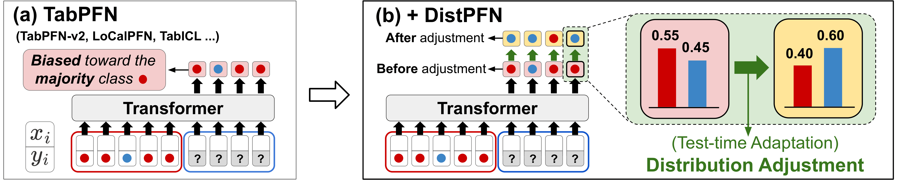

# Mitigating Label Shift in Tabular In-Context Learning via Test-Time Posterior Adjustment


<p align="center">
  <a href="https://arxiv.org/pdf/2605.04363"></a>
  <a href="https://opensource.org/licenses/Apache-2.0"></a>
</p>

🎉 Our paper *Mitigating Label Shift in Tabular In-Context Learning via Test-Time Posterior Adjustment* has been accepted to **ICML 2026**.

<br>

<p align="center">
  
</p>

The proposed DistPFN mitigates label shift in TabPFN-based models by performing test-time posterior adjustment that **rebalances the influence of training priors and predicted posteriors** without additional training.

<br>

---

## How to use?

**DistPFN & DistPFN-T** : **Plug-in** methods for any **tabular foundation models based on in-context learning**
```python
classifier.fit(X_train, y_train)
y_prob = classifier.predict_proba(X_test)

if DistPFN:
    P_test_avg = y_prob.mean(axis=0)  
    y_prior_train = np.bincount(y_train) / len(y_train)
    adjusted = (y_prob * P_test_avg) / (y_prior_train + 1e-8)
    y_prob = adjusted / adjusted.sum(axis=1, keepdims=True)  

if DistPFN_T:
    P_test_avg = y_prob.mean(axis=0)
    y_prior_train = np.bincount(y_train) / len(y_train)
    tau = cross_entropy(P_test_avg, y_prior_train)
    P_test_avg = softmax_temperature(P_test_avg, T=tau)
    adjusted = (y_prob * P_test_avg) / (y_prior_train + 1e-8)
    y_prob = adjusted / adjusted.sum(axis=1, keepdims=True)

y_pred_cls = y_prob.argmax(axis=1)
```


<br>


### Step 1) Installation
```bash
conda create --name tabpfn python=3.9
conda activate tabpfn
pip install tabpfn[full]
pip install -r requirements.txt
```

- Please change BASE_DIR in `src/__init__.py`!

<br>

### Step 2) Generating datasets

```shell
python3 -m src.evals.datasets
```
<br>

### Step 3) Evaluation

```shell
python -m src.evals.eval_TABPFN_shift_O # w/ label shift
python -m src.evals.eval_TABPFN_shift_X # w/o label shift
```

--- 

## Citation

If you find this work useful, please cite:

```bibtex
@article{lee2026mitigating,
  title={Mitigating Label Shift in Tabular In-Context Learning via Test-Time Posterior Adjustment},
  author={Lee, Seunghan and Lee, Jaehoon and Seo, Jun and Yoo, Sungdong and Kim, Minjae and Lim, Tae Yoon and Kang, Dongwan and Choi, Hwanil and Lee, SoonYoung and Ahn, Wonbin},
  journal={arXiv preprint arXiv:2605.04363},
  year={2026}
}
```


## Acknowledgements

We thank the respective authors for releasing their official codebases:
- [TabPFN](https://github.com/PriorLabs/TabPFN),
- [TabICL](https://github.com/soda-inria/tabicl), and
- [AutoML](https://github.com/automl).  [oai_citation:0‡GitHub](https://github.com/PriorLabs/TabPFN?utm_source=chatgpt.com)

## Contact

Seunghan Lee — seunghan.lee@lgresearch.ai


